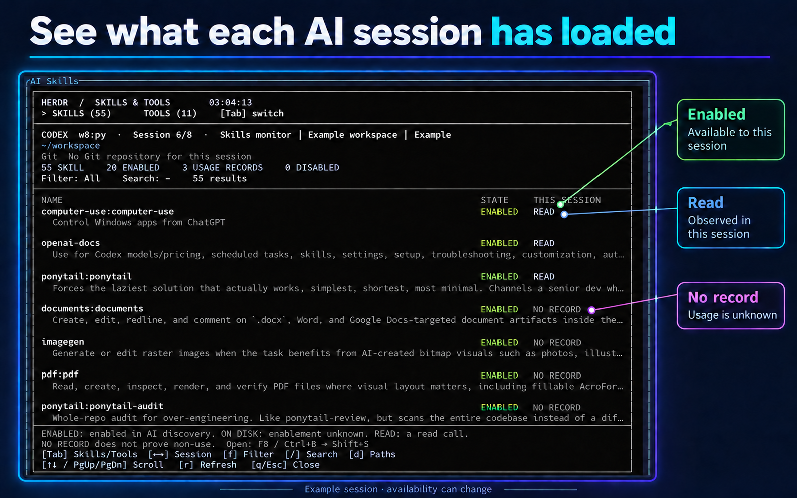

# AI Skills for Herdr

[](#install)
[](#language)
[](https://github.com/tunaunuvar/herdr_skills_plugin/tree/v0.4.1)
[](LICENSE)

A dependency-free Node.js popup for seeing which AI skills and tools are available in each Herdr session, and which ones have recorded use. It runs on Windows, macOS and Linux with Herdr 0.9.0+ and Node.js 18+.



*An annotated example of the popup. Session counts and names can change; local user and workspace details are replaced with examples.*

## Language

The interface is in English by default. Press **`l`** to switch between English and Spanish. Skill names, descriptions and session titles keep their original language.

## Install

```sh
herdr plugin install tunaunuvar/herdr_skills_plugin
herdr plugin action invoke open --plugin tunaunuvar.herdr-skills
```

Or add a direct F8 shortcut to Herdr's `config.toml`, then run `herdr server reload-config`:

```toml
[[keys.command]]
key = "f8"
type = "plugin_action"
command = "tunaunuvar.herdr-skills.open"
description = "open AI skills"
```

The Herdr prefix shortcut (Ctrl+B, then Shift+S) is also available:

```toml
[[keys.command]]
key = "prefix+shift+s"
type = "plugin_action"
command = "tunaunuvar.herdr-skills.open"
description = "open AI skills and installed tools"
```

## What it shows

- Skills and common command-line tools discovered for each agent session.
- The session's Git branch and staged, modified, deleted, untracked and ahead/behind changes. Git status is read-only; the plugin does not fetch or change files.
- **Graft** and common commands under Tools—including AI CLIs, Git, Node.js/npm, Python/uv, ripgrep and Firebase—even when they do not have a `SKILL.md` file.
- Compact descriptions, filters, search and optional file paths. The list refreshes every 30 seconds.

Use **Tab** for Skills/Tools, **Left/Right** to change agent or session, **`f`** to cycle filters, **`/`** to search, **`d`** to show paths, **`l`** to change language, **`r`** to refresh, and **`q`** or **Escape** to close. Up/Down and PageUp/PageDown scroll the list.

## Labels

- **ENABLED / DISABLED**: Codex's local `skills/list` discovery state. This does not prove an open conversation has reloaded the skill.
- **ON DISK**: a local skill file was found, including Codex plugin-cache files; enablement is unknown.
- **READ**: a matching full-path skill read was observed in this agent session's local transcript. It does not prove the read succeeded or that the skill is active now.
- **NO RECORD**: no matching read was found. This does not prove non-use; injected skills, relative paths and remote sessions may not leave matching evidence.
- **INSTALLED**: a command file exists on Herdr's PATH. Its version and successful execution are not inferred.
- **CALL OBSERVED**: a command invocation was found in the session transcript; no command is executed for discovery.

## Data and compatibility

Live session contexts are supported for Codex, Claude Code, OMP and Pi. Codex CLI is optional; without it, local skill files and installed tools are still listed. Codex uses its local app-server for skill discovery and supplements it with local skills and cache files. Other agents scan shared `.agents/skills`, their user skill directories and project skill directories up to the repository root; their enablement state remains unknown. Plugin-provided skills outside those roots are not discovered for other agents. Agents without an adapter are reported rather than guessed. Herdr pane/session identity is used to select transcript evidence instead of assuming the newest transcript belongs to the focused agent. User directories and executable locations are discovered at runtime; no machine-specific paths are bundled.

The popup reads discovery data and local transcripts only. It does not change agent settings or install/remove skills, and it does not display conversation contents. macOS/Linux are supported by the implementation but have not been run end-to-end in this workspace.

## Development

```sh
node --check skills.js
node skills.test.js
node skills.test.js --live
node skills.js --json
```

The normal checks use Node.js built-ins only. Live discovery requires the local Herdr server and Codex CLI.

References: [Herdr plugins](https://herdr.dev/docs/cli-reference/), [keybindings](https://herdr.dev/docs/configuration/), [Codex skills/list](https://learn.chatgpt.com/docs/app-server#skills).

## License

MIT. See [LICENSE](LICENSE).
